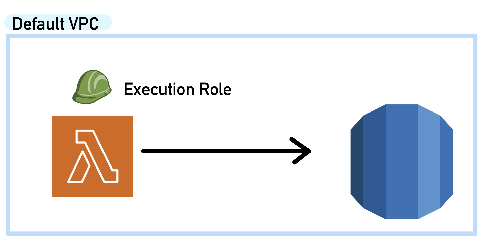

# Tutorial: Configuring a Lambda function to access Amazon RDS in an Amazon VPC  
[Link to Tutorial Article](https://docs.aws.amazon.com/lambda/latest/dg/services-rds-tutorial.html)  
  
In this tutorial, I created an RDS instance and an AWS Lambda function that connected to the MySQL instance, created a table named "Employee" and inserted three rows into said table.

## Short Overview of the Steps Took
1. **Created an execution role for the Lambda function** so that it had permissions to "manage network connections to a VPC."
2. **Created an RDS MySQL instance** to use.
3. **Created a deployment package for the creation of our AWS Lambda function**
4. **Tested the lambda function** and verified success by looking at the AWS Cloudwatch logs in the AWS Lambda Console.

